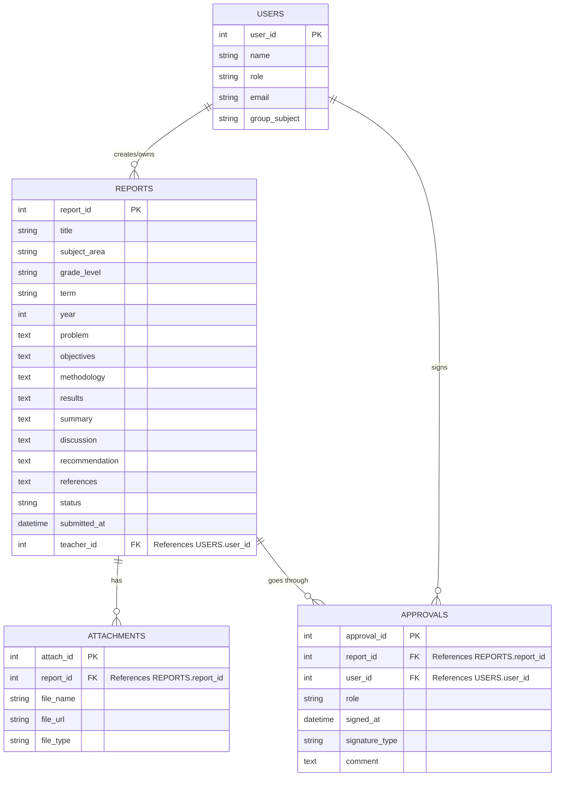
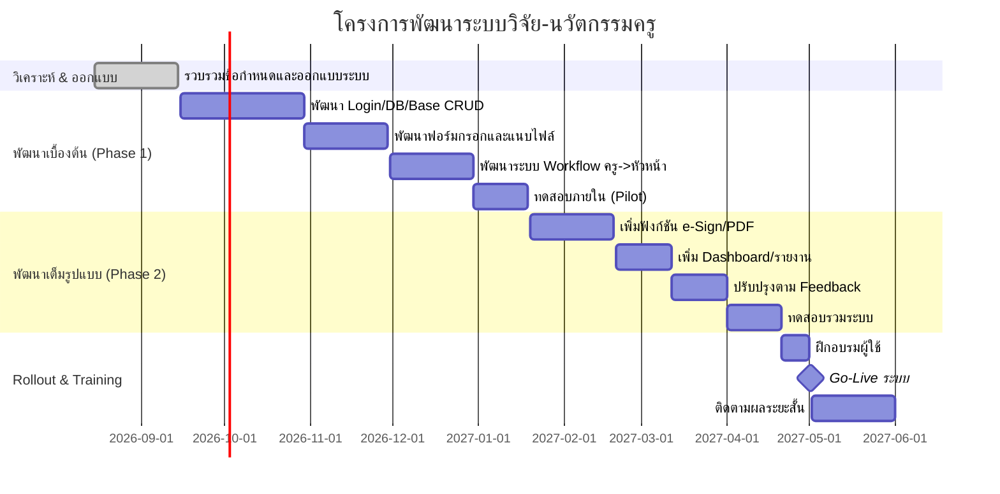

# ระบบรายงานผลการวิจัยในชั้นเรียนและนวัตกรรมครูแบบดิจิทัล — เอกสารออกแบบระบบ

## บทสรุปผู้บริหาร
ระบบรายงานผลการวิจัยในชั้นเรียนและนวัตกรรมครูแบบดิจิทัลนั้นต้องออกแบบให้สอดคล้องกับข้อกำหนดทางราชการของประเทศไทย เช่น พระราชบัญญัติธุรกรรมทางอิเล็กทรอนิกส์ (พ.ศ. 2544) ซึ่งรองรับการลงลายมือชื่ออิเล็กทรอนิกส์และลายมือชื่อดิจิทัล พร้อมกำหนดระยะเวลาการเก็บรักษาเอกสารราชการไม่น้อยกว่า 10 ปี ระบบจึงควรบันทึกข้อมูลผู้ส่ง ผู้ตรวจ และผู้ลงนามทุกขั้นตอนพร้อมป้องกันการแก้ไขเอกสารภายหลังการลงชื่อ ออกแบบ Workflow ตรวจสอบแบบหลายขั้นตอน (ครู → หัวหน้าภาควิชา → ฝ่ายวิชาการ → ผู้อำนวยการ) โดยแต่ละขั้นตอนผู้รับผิดชอบจะรับรองด้วยลายเซ็นดิจิทัลหรือรูปแบบอิเล็กทรอนิกส์ที่เหมาะสมทั้งบนมือถือและคอมพิวเตอร์ ระบบควรมีฐานข้อมูลจัดเก็บฟิลด์รายงาน (ชื่อเรื่อง, ผู้วิจัย, กลุ่มสาระ, ระดับชั้น, เทอม/ปีการศึกษา, ปัญหา, วัตถุประสงค์, วิธีการ, ผลการวิจัย, สรุปผล ฯลฯ) รวมทั้งแนบไฟล์หลักฐาน (เอกสาร PDF/Word, แผนการสอน, รูปภาพ ฯลฯ) โดยโครงสร้างฐานข้อมูลจะเชื่อมโยงกับตารางผู้ใช้ (ผู้จัดทำ/ผู้ตรวจ) เพื่อกำหนดสิทธิ์เข้าถึงตามบทบาท ทั้งหมดนี้นำไปสู่ระบบออนไลน์ครบวงจรที่ไม่ต้องพิมพ์กระดาษเลยแต่มีความปลอดภัย **ถูกต้องตามกฎหมาย-ตรวจสอบได้-ค้นคืนได้** โดยสิ้นสุดที่การสร้างเอกสาร PDF ชุดสุดท้ายที่ล็อกเวอร์ชันหลังลงชื่อ

## กฎหมายและข้อกำหนดที่เกี่ยวข้อง
- **พระราชบัญญัติว่าด้วยธุรกรรมทางอิเล็กทรอนิกส์ (พ.ศ.2544)** กำหนดว่า การลงลายมือชื่อดิจิทัล (Digital Signature) ต้องใช้กุญแจสาธารณะ (PKI) ตามมาตรา 26 หากระบบออกแบบให้ใช้วิธีการยืนยันตัวตนตามกฎหมาย (เช่น ใบรับรองดิจิทัล) เอกสารจะมีผลทางกฎหมายเทียบเท่าลายมือชื่อกระดาษ แต่หากเลือกใช้ e-Signature แบบทั่วไป (เช่น วาดลายเซ็นหรือเซ็นรับทราบด้วยสัญลักษณ์) ก็สามารถใช้ได้เช่นกันโดยอิงตามความเสี่ยงและวัตถุประสงค์
- **กฎหมายคุ้มครองข้อมูลส่วนบุคคล (PDPA, พ.ศ.2562)** หากระบบเก็บข้อมูลส่วนตัวของครูหรือนักเรียน ต้องปฏิบัติตามมาตรฐานการปกป้องข้อมูล (เช่น ไม่เปิดเผยข้อมูลส่วนบุคคลโดยไม่ได้รับความยินยอม) และต้องมีการรักษาความปลอดภัยข้อมูลไม่ให้รั่วไหล
- **ข้อกำหนดการเก็บรักษาเอกสารราชการ** ตามแนวปฏิบัติสารบรรณ การจัดเก็บหนังสือราชการทั่วไปจะต้องเก็บอย่างน้อย 10 ปี กรณีเอกสารที่ยังมีความจำเป็นศึกษาค้นคว้าหรือเป็นหลักฐานสำคัญ ยกเว้นเอกสารซ้ำสำเนาอาจเก็บ 5 ปีก็พอ ดังนั้นระบบต้องออกแบบให้สำรองข้อมูลรายงานให้อยู่ได้นานและสามารถจัดการทำลายหรือเก็บต่อเมื่อครบอายุหนังสือราชการตามระเบียบ
- **แนวทางสำนักพัฒนารัฐบาลดิจิทัล (DGA/ETDA)** แม้ปัจจุบันไม่มีมาตรการเฉพาะสำหรับงานสารสนเทศครูวิจัย แต่มีคำแนะนำการใช้งาน e-Signature ทั่วไปจาก ETDA ที่แบ่งลายเซ็นอิเล็กทรอนิกส์เป็น 3 ระดับ (ทั่วไป/เชื่อถือได้/มีใบรับรองจาก CA) ระบบนี้จึงควรเลือกให้ผู้ใช้ลงลายมือชื่อแบบ "เชื่อถือได้" ในกรณีที่เอกสารเป็นทางการ (ใช้กุญแจ PKI หรือใบรับรองดิจิทัล) และสำหรับขั้นตอนเบื้องต้นหรืองานภายในที่ความเสี่ยงต่ำกว่า อาจใช้การวาดลายเซ็นด้วยนิ้ว (stylus) หรืออัพโหลดรูปภาพลายเซ็นได้

## ตัวอย่างระบบและแนวปฏิบัติที่เกี่ยวข้อง
- **ระบบสารบรรณอิเล็กทรอนิกส์** (e-Saraban, e-Office): หน่วยงานของรัฐไทยหลายแห่งใช้ระบบสารบรรณอิเล็กทรอนิกส์ในการรับส่งหนังสือราชการภายใน เช่น สำนักงานเขตพื้นที่การศึกษา สพฐ. ใช้ "Smart Office" หรือ "My Office" ซึ่งรองรับการลงนามดิจิทัลและจัดเก็บเอกสาร โดยรูปแบบคล้ายกับที่เราต้องการคือการส่งหนังสือขึ้นระบบและตรวจสอบสถานะได้แม้ไม่พิมพ์
- **ระบบบริหารงานวิจัย**: มหาวิทยาลัยไทยหลายแห่งมีระบบบริหารวิจัย (เช่น RMUTSV DRMS) และมีผลงานชิ้นส่วนวิจัยลงในระบบ **NRIIS** (National Research Information System) ของ วช. โดยรวมเป็นคลังข้อมูลกลางด้านวิจัยและนวัตกรรม การออกแบบระบบรายงานครูควรใส่แนวคิดคลังผลงาน (ค้นหาได้) คล้าย NRIIS ในระดับโรงเรียน/กลุ่มงานด้วย
- **โครงการลายเซ็นดิจิทัลในศึกษา**: โครงการ TUC-CA (Thai University Consortium Certification Authority) ของ มข. ได้ออกใบรับรองดิจิทัลกว่า 60,000 รายการ ให้กับหน่วยงานการศึกษาในสังกัด กอศ. ช่วยลดการใช้กระดาษกว่า 30% ใช้ในการออก "วุฒิบัตรอิเล็กทรอนิกส์" และงานอื่นๆ แสดงให้เห็นว่าการใช้ PKI ในระบบการศึกษาประสบผลสำเร็จเช่นกัน (ระบบเราสามารถเลือกใช้เทคโนโลยีแบบเดียวกันหากต้องการระดับความมั่นคงสูง)
- **ตัวอย่างต่างประเทศ**: ในสหรัฐฯ การนำ e-Signature มาใช้ในโรงเรียน K-12 นิยมมากขึ้น องค์กรจัดซื้อสัญญา โรงเรียน, ใบอนุญาตครู ฯลฯ ใช้ระบบอัตโนมัติ เช่น "DocuSign for K-12" โฆษณาว่าเพิ่มเวลาการสอนได้ ซึ่งยืนยันว่าผลักดันกระบวนการอิเล็กทรอนิกส์ช่วยประหยัดเวลาและลดข้อผิดพลาดในการกรอกข้อมูล แม้ระบบเราจะขนาดเล็กกว่า แต่แนวคิดคือเดียวกัน
- **แนวปฏิบัติที่ดี**: เช่นการให้ครูกรอกผ่านมือถือได้ (mobile-first UI) ลดขั้นตอนยิบย่อย เช่น autocomplete รายชื่อครู/สาระ, แนบไฟล์ได้หลายประเภท, และระบบควรส่งแจ้งเตือนอัตโนมัติ (Email/LINE/Push) เมื่อถึงกำหนดส่งหรือเมื่องานถูกส่งกลับเพื่อแก้ไข

## รูปแบบการลงลายมือชื่อดิจิทัล
ระบบควรรองรับการลงนามอิเล็กทรอนิกส์แบบต่างๆ ดังนี้ (เปรียบเทียบข้อดี-ข้อเสียตามตารางด้านล่าง):

| วิธีลงชื่อ            | ลักษณะ/เทคโนโลยี                                       | ความน่าเชื่อถือ (Trust)           | สะดวกใช้งาน (UX)        | ข้อพิจารณา                                 |
|-----------------------|---------------------------------------------------------|-------------------------------------|--------------------------|----------------------------------------------|
| **วาดลายมือ (stylus)** | เซ็นบนหน้าจอด้วยนิ้วหรือปากกา (Signature Pad JS)         | ต่ำ (เป็น e-Signature ธรรมดา)      | สูง (มือถือรองรับ)       | ไม่ยืนยันตัวคนได้ จึงใช้ได้กับเอกสารภายใน/เบื้องต้น |
| **อัปโหลดภาพลายเซ็น**  | ป้อนภาพลายเซ็นสแกนจากกระดาษลงระบบ                        | ต่ำ–ปานกลาง (ขึ้นกับกระบวนการ)     | ปานกลาง (ต้องเตรียมไฟล์)  | เสี่ยงการปลอมแปลงหากภาพรั่วไหล ต้องควบคุมไฟล์ดีๆ  |
| **Google/SSO Attestation** | ใช้ระบบยืนยันตัวตน Google/โรงเรียน (เช่น ลงชื่อด้วย G Suite) | ปานกลาง (พิสูจน์ตัวผู้ใช้แต่ไม่มี PKI) | สูง (ไม่ต้องมีคีย์พิเศษ)   | ต้องพึ่ง Google SSO แต่ส่งผลน้อยกว่าลายมือชื่อดิจิทัล (เป็น e-Signature ทั่วไป) |
| **Digital Signature (PKI)** | ใช้ใบรับรองดิจิทัล (NRCA/G-CA) เข้ารหัสเอกสาร        | สูง (ตรวจสอบผู้ลงชื่อได้แน่นอน)   | ต่ำถึงปานกลาง (ต้องออกใบรับรองก่อน) | เป็นลายเซ็นที่กฎหมายรองรับเต็มตัว ต้องใช้โครงสร้างพื้นฐาน PKI |

> **หมายเหตุ:** องค์ประกอบตามพระราชบัญญัติฯ ต้องเป็นไปตาม มาตรา 26 ETA (ข้อมูลสร้างลายมือชื่อเชื่อมโยงเจ้าของ, เก็บคีย์ปลอดภัย, ตรวจสอบการแก้ไขได้)

## การพิสูจน์ตัวตนและ Audit Trail
- **การยืนยันตัวตน (Authentication):** ใช้ระบบลงชื่อเข้าใช้ของโรงเรียน (เช่น บัญชี Google โรงเรียน หรือระบบ Single Sign-On ของ สพฐ./สช.) เพื่อยืนยันตัวผู้ใช้แต่ละคน ผู้ใช้แต่ละบทบาท (ครู, หัวหน้ากลุ่มสาระ, ฝ่ายวิชาการ, ผู้อำนวยการ) ต้องมีบัญชีของตนเอง ระบบลงชื่อเข้าจะบันทึกว่าใครทำอะไร เมื่อไร
- **Audit Trail (ตราประทับเวลา):** ทุกการกระทำสำคัญ (ส่งรายงาน, ตรวจสอบ, ลงนาม) จะบันทึกเวลาจริง (timestamp) ไว้ในฐานข้อมูล พร้อม IP Address ของผู้ทำให้ เป็นหลักฐานทางอิเล็กทรอนิกส์เพื่อป้องกันการปฏิเสธ (non-repudiation) และสร้างความโปร่งใส
- **การล็อกเวอร์ชัน:** เมื่อใครคนใดลงนาม ณ เวลาหนึ่ง ระบบจะ "ปิดบันทึก" เวอร์ชันนั้นไว้ (เช่น สร้าง PDF เก็บล็อก หรือคำนวณ hash) ถ้าต้องการแก้ไขต่อหลังจากลงชื่อ ระบบต้องยกเลิก/ยกเลิกการรับรองเดิมและให้เซ็นใหม่ เพื่อป้องกันการเปลี่ยนแปลงเอกสารหลังลงชื่อเหมือนการทำสำเนาใหม่
- **การเพิกถอนลายเซ็น:** หากผู้ใช้แก้ไขเนื้อหา (เช่น หัวหน้าตีกลับให้ครูแก้ไข) ระบบจะทำเครื่องหมายคืนสถานะที่ต้องแก้ไข และ "เพิกถอน" ลายเซ็นขั้นตอนก่อนหน้านี้ ทำให้ต้องเซ็นรับรองใหม่เมื่อส่งกลับมาอีกครั้ง
- **ความปลอดภัย:** ข้อมูลทั้งหมด (รายงาน, รูปภาพ, ไฟล์) ควรเข้ารหัสและสำรองระบบอย่างสม่ำเสมอ บังคับใช้ SSL/TLS สำหรับทุกการส่งข้อมูล และควรใช้ระบบรักษาความปลอดภัยของข้อมูลส่วนบุคคลตาม PDPA เพราะมีข้อมูลครู/นักเรียน

## Workflow การส่ง ตรวจ และลงนามรับรอง
ระบบจะมีสถานะงานแบบหลายขั้นตอนดังนี้:
1. **ครูผู้จัดทำ (ผู้เสนอ):** เข้าสู่ระบบด้วยบัญชีครู บันทึกรายงานวิจัย/นวัตกรรมผ่านฟอร์มออนไลน์ พร้อมแนบไฟล์หลักฐาน เสร็จแล้วคลิก "ส่ง" ระบบจะตรวจสอบข้อมูลเบื้องต้น (เช่น ความสมบูรณ์ของฟิลด์) แล้วบันทึกสถานะเป็น "ส่งแล้ว (รอตรวจ)"
2. **หัวหน้ากลุ่มสาระ:** ระบบแจ้งเตือนครูผ่านระบบ เมื่อหัวหน้าล็อกอินเข้ามาจะเห็นรายการที่ส่งมา ช่วยตรวจสอบเนื้อหาและไฟล์หลักฐาน **(อาจอนุมัติหรือส่งกลับให้แก้ไข)** เมื่อเรียบร้อยหัวหน้ากด **"ลงชื่อรับรอง"** (วาดลายเซ็น/ใช้ PKI ตามนโยบาย) เป็นการบันทึกว่าได้รับรองแล้ว จากนั้นเปลี่ยนสถานะเป็น "ผ่านหัวหน้าสาระ/รอตรวจฝ่ายวิชาการ"
3. **ฝ่ายวิชาการ (กลุ่มงานวิชาการ):** รับตรวจงานซ้ำอีกครั้งในมุมกว้าง (สอดคล้องนโยบายโรงเรียน) หากมีข้อสังเกตหรือขาดอะไรจะส่งกลับครูพร้อมบันทึกเหตุผล (สถานะ "ต้องแก้ไข") หากทุกอย่างเรียบร้อย ฝ่ายวิชาการลงชื่อรับรอง (e-Sign) และเปลี่ยนสถานะเป็น "ผ่านวิชาการ/รอตรวจ ผอ."
4. **ผู้อำนวยการโรงเรียน:** รับงานจากฝ่ายวิชาการ ตรวจสอบความถูกต้องสุดท้าย (อาจเปิดอ่าน PDF เวอร์ชันปัจจุบัน) หากมีปรับแก้อาจส่งกลับ แต่ขั้นตอนนี้น้อยครั้งกว่า เมื่อผู้อำนวยการลงนามอนุมัติเป็นขั้นตอนสุดท้าย (สแกนลายเซ็นบน PDF หรือใช้ใบรับรองดิจิทัล) ให้ถือว่า **จบกระบวนการ** สถานะเป็น "อนุมัติแล้ว"
5. **คลังผลงาน:** รายงานฉบับสุดท้าย (พร้อมลายเซ็นทุกขั้น) จะถูกจัดเก็บเป็นเอกสาร PDF ล็อกเวอร์ชัน (ไม่แก้ไขได้) และปรากฏในคลังค้นหาของระบบ ครูและผู้บริหารที่มีสิทธิ์สามารถค้นอ่านย้อนหลังได้ (ระบบควรให้สิทธิ์การดูตามบทบาท เช่น ผอ. เห็นทุกงาน ฝ่ายวิชาการเห็นทุกงานในโรงเรียน ครูเห็นเฉพาะงานของตนเอง)

```mermaid
flowchart TD
    ครูส่งงาน(ครู ส่งรายงาน) --> HeadApprove(หัวหน้าสาระ ตรวจ/ลงนาม)
    HeadApprove --> AcadApprove(ฝ่ายวิชาการ ตรวจ/ลงนาม)
    AcadApprove --> DirApprove(ผู้อำนวยการ ลงนามอนุมัติ)
    subgraph Feedback [ ]
      AcadApprove -->|ส่งกลับแก้ไข| ครูส่งงาน
      HeadApprove -->|ส่งกลับแก้ไข| ครูส่งงาน
    end
```

## โครงสร้างข้อมูล (Data Model)
ฐานข้อมูลหลักประกอบด้วยตารางสำคัญ ได้แก่
- **Users (ผู้ใช้)**: เก็บข้อมูลผู้ใช้ (ครู, หัวหน้ากลุ่ม, ฝ่ายวิชา, ผู้อำนวยการ) เช่น `user_id, ชื่อ, บทบาท, กลุ่มสาระ, รหัสผ่าน, อีเมล`
- **Reports (รายงานวิจัย/นวัตกรรม)**: ข้อมูลฟิลด์หลักของรายงาน เช่น `report_id, title, teacher_id (FK), subject_area, grade_level, term, academic_year, problem, objectives, hypothesis, target_group, tools, methodology, results, summary, discussion, recommendation, references, status, submitted_at`
- **Attachments (ไฟล์แนบ)**: ตารางเก็บไฟล์แนบ ซึ่งอาจเชื่อมต่อกับ Google Drive/Storage ภายนอก เช่น `attach_id, report_id (FK), file_name, file_type, file_url`
- **Approvals (การอนุมัติ)**: บันทึกรายการตรวจและลงนาม เช่น `approval_id, report_id (FK), user_id (FK), role, signed_at, signature_type, comment` เพื่อเก็บลายเซ็นและความคิดเห็นในแต่ละขั้น



**ฟิลด์เอกสารหลัก (ตัวอย่าง):** ชื่อเรื่อง, ชื่อผู้วิจัย/ผู้จัดทำ, กลุ่มสาระ, ระดับชั้น, เทอม/ปีการศึกษา, ที่มาและความสำคัญ, วัตถุประสงค์, สมมติฐาน, กลุ่มเป้าหมาย, เครื่องมือวิจัย, วิธีการ, ผลการวิจัย, สรุปผล, อภิปรายผล, ข้อเสนอแนะ, เอกสารอ้างอิง เป็นต้น (*สามารถปรับลดได้ตามนโยบายโรงเรียน*)

## การแนบไฟล์และการจัดเก็บ (File Storage)
ระบบต้องรองรับไฟล์หลายประเภท (PDF, Word, รูปภาพ JPG/PNG ฯลฯ) โดยมี 2 แนวทางหลัก:
- **Google Drive/Sheets Integration:** ใช้ Google Drive เป็นคลังไฟล์ (หากโรงเรียนใช้ G Suite) โดยระบบอาจบันทึก URL ไฟล์ในตาราง `ATTACHMENTS` พร้อมเก็บข้อมูลเมตาดาต้าใน Google Sheets หรือ Firebase Realtime DB ตัวอย่าง: ระบบกรอกข้อมูลบนเว็บ ไปเขียนลง Google Sheets, ไฟล์ต่างๆ อัพโหลดไป Drive แล้วเก็บลิงก์
  - *ข้อดี:* ไม่ต้องสร้างเซิร์ฟเวอร์จัดเก็บไฟล์เอง ฟรีในแผนการศึกษาที่ใช้ G Suite, เปิด/แก้ไขเอกสารด้วย Google Docs ได้ง่าย
  - *ข้อเสีย:* ควบคุมทรัพยากรได้จำกัด (ต้องใช้ API ของ Google), ค้นหาข้อมูลเชิงซับซ้อนไม่สะดวกเท่า RDBMS, ความเป็นส่วนตัวต้องกำหนดสิทธิ์ชัดเจน
- **ฐานข้อมูลเฉพาะและระบบไฟล์แยก:** ใช้ฐานข้อมูลเชิงสัมพันธ์ (เช่น MySQL/PostgreSQL) หรือ NoSQL (Firebase/Firestore) เก็บเมตาดาต้า และใช้ cloud storage (Amazon S3, Azure Blob, หรือโฮสต์โรงเรียน) เก็บไฟล์จริง พร้อมเซิฟเวอร์ API เรียกใช้งาน
  - *ข้อดี:* ยืดหยุ่น ควบคุมได้ละเอียด, สเกลง่าย, จัดการสิทธิ์แบบละเอียด
  - *ข้อเสีย:* ต้องลงทุนระบบจัดเก็บและบำรุงรักษา (อาจมีค่าใช้จ่าย), พัฒนาโค้ดเชื่อมต่อมากขึ้น

| ตัวเลือก | ข้อดี | ข้อจำกัด |
|---|---|---|
| **Google Drive + Sheets** | ใช้บริการฟรีที่มีอยู่ (Google Workspace), เชื่อมต่อกับ Google SSO ได้ง่าย | เป็นระบบ Lock-in ของ Google, ปรับโครงสร้างข้อมูลยาก, จำกัดขนาดไฟล์/จำนวนไฟล์ |
| **MySQL/PostgreSQL + Storage** | ควบคุมโครงสร้างได้, รองรับค้นหา-จัดเรียงข้อมูลได้ดี, สเกลง่ายตามต้องการ | ต้องลงทุนเซิร์ฟเวอร์หรือคลาวด์เอง, อาจมีค่าเช่า/บำรุงรักษาเพิ่ม |
| **Firebase/Firestore + Cloud Storage** | ไม่ต้องบริหารเซิร์ฟเวอร์เอง, Realtime DB และ Authentication ในตัว | ค่าใช้จ่ายขึ้นกับปริมาณการใช้งาน, ต้องเรียนรู้เทคโนโลยีใหม่ |

## การสร้าง PDF อัตโนมัติและการล็อกเวอร์ชัน
- **Generation:** เมื่อรายงานผ่านทุกขั้นตอนและอยู่สถานะ "อนุมัติแล้ว" ระบบจะสร้างไฟล์ PDF แบบเต็ม (รวมเนื้อหาฉบับสมบูรณ์) โดยแทรกลายเซ็นของแต่ละขั้น (ภาพเซ็นหรือข้อมูลดิจิทัล) ลงในหน้าสุดท้าย อาจใช้ไลบรารี PDF เช่น wkhtmltopdf, PDFKit (Node.js), ReportLab (Python) หรือ jsPDF (JavaScript)
- **การล็อกเวอร์ชัน:** หลังสร้าง PDF หากใช้ **Digital Signature (PKI)** สามารถสั่งเซ็นไฟล์ PDF เพื่อให้ไม่สามารถแก้ไขได้อีก (ตรวจสอบโดย Acrobat Reader ว่าไฟล์สมบูรณ์ตั้งแต่เซ็น) หรือถ้าไม่ใช้ PKI ก็สามารถบันทึกไฟล์ PDF เป็นแบบอ่านอย่างเดียว (Disable Editing) และเก็บสำเนาเดิมไว้
- **การเก็บรักษา:** ไฟล์ PDF ปิดท้ายจะถูกรวบรวมใน "คลังผลงานอิเล็กทรอนิกส์" ของโรงเรียน สำหรับอนุกรมหมายเลขประจำตัว, metadata รายงาน และชื่อไฟล์ เอกสารจะถูกสำรองและจัดเก็บตามระยะเวลาไม่น้อยกว่า 10 ปี เช่น ในระบบไฟล์สำรองโรงเรียนหรือคลังข้อมูลอิเล็กทรอนิกส์ (แยกต่างหากจากระบบฐานข้อมูลหลัก)
- **สำเนาที่เกี่ยวข้อง:** หากหน่วยงานของรัฐต้องการ มักต้องสามารถพิมพ์หรือดึง PDF ออกมาเป็นเอกสารส่งราชการได้ทันที (ควรจัดรูปแบบให้เหมาะสมกับแบบฟอร์มราชการและใส่หมายเลขหนังสืออ้างอิงตามต้องการ)

## สิทธิ์การเข้าถึงและบทบาท (Access Control)
กำหนดสิทธิ์ตามบทบาทเพื่อป้องกันการเข้าถึงข้อมูลไม่เหมาะสม:
- **ครูผู้จัดทำ:** เห็นและแก้ไขงานตัวเองได้ตลอดจนส่งและดูสถานะ แต่ดูงานคนอื่นไม่ได้
- **หัวหน้ากลุ่มสาระ:** เห็นงานทั้งหมดในกลุ่มสาระตนเอง (ดูรายการส่งมา, ประวัติการส่งของครูในกลุ่ม) สามารถเปลี่ยนสถานะงาน (ส่งกลับแก้ไข/อนุมัติ) ให้หัวหน้ากดเซ็นได้
- **ฝ่ายวิชาการ:** เห็นงานทั้งหมดของโรงเรียน (โดยผ่าน Dashboard ของฝ่ายวิชาการ) สามารถตรวจและสั่งลงนามได้ โดยข้อมูลของหัวหน้าสาระและครูจะเชื่อมโยงกัน
- **ผู้อำนวยการ:** เห็นงานทั้งหมดของโรงเรียน สามารถอนุมัติขั้นสุดท้าย (เซ็นไฟล์ PDF)
- **ผู้ดูแลระบบ (IT):** ตั้งค่าระบบ, จัดการผู้ใช้ แต่อาจไม่มีสิทธิแก้ไขข้อมูลรายงาน (ยกเว้นกรณีฉุกเฉิน)

ระบบควรใช้กลไก Authentication (login/password หรือ SSO) ร่วมกับ Role-Based Access Control (RBAC) เพื่อกำหนดว่าบทบาทใดทำอะไรได้ เช่น หัวหน้าสาระกดปุ่ม "อนุมัติ" ได้ ในขณะที่ครูไม่มีปุ่มนั้น ส่วนการดูและแก้ไขข้อมูลก็เฉพาะของตนหรือในขอบเขตที่อนุญาต

## ความปลอดภัยและความเป็นส่วนตัว
- **การป้องกันข้อมูล:** ใช้ HTTPS/SSL ทุกการเชื่อมต่อ, รหัสผ่านเข้ารหัส (hash+salt), และควรพิจารณาเข้ารหัสข้อมูลสำคัญ (เช่น เอกสารวิจัยที่เป็นความลับภายใน) ในฐานข้อมูลหรือพื้นที่จัดเก็บไฟล์
- **การตรวจสอบ:** ระบบบันทึก log การทำงาน (Audit log) ทุกฟังก์ชันที่สำคัญ เช่น การเข้าสู่ระบบ, การส่งงาน, การแก้ไขงาน, การดาวน์โหลด PDF ฯลฯ เพื่อกรณีตรวจสอบย้อนหลัง
- **การป้องกันการปลอมแปลง:** การใช้ลายเซ็นอิเล็กทรอนิกส์ที่ "เชื่อถือได้" (เช่น PKI) ช่วยตรวจจับการเปลี่ยนแปลงเอกสารภายหลังได้ การใช้วิธีอื่นๆ ควรเพิ่มชั้นการยืนยันตัวตนอื่นประกอบ เช่น การส่งรหัส OTP ทาง SMS ก่อนลงนาม
- **ความเป็นส่วนตัว (PDPA):** หากในรายงานมีข้อมูลนักเรียน ระบบต้องมีการขอความยินยอม และจำกัดการเข้าถึงข้อมูลนักเรียนเฉพาะผู้เกี่ยวข้อง
- **Backups:** สำรองข้อมูลรายงานและไฟล์แนบอย่างสม่ำเสมอ (ควรกำหนดนโยบายสำรองข้อมูล ไม่น้อยกว่าวันละครั้งเก็บอย่างน้อย 1 เดือน) เพื่อป้องกันข้อมูลสูญหายจากความเสียหายของฮาร์ดแวร์

## เทคโนโลยีและเครื่องมือแนะนำ
- **Web Framework:** ภาษาและ Framework ยอดนิยม เช่น **Node.js (Express/React)**, **Python (Django/Flask + Vue/React)**, **PHP (Laravel + Vue)** หรือถ้าเน้น Google Integration อาจใช้ **Google Apps Script** (ในการทำ Web App บน G Suite) ทั้งหมดสามารถรองรับฐานข้อมูล SQL/NoSQL ได้
- **ฐานข้อมูล:** หากเลือกใช้ **Google Firebase/Firestore** จะได้ Authentication และ Real-time DB พร้อม (ใช้งานง่าย แต่มีข้อจำกัด volume) หากใช้ตนเอง **MySQL/PostgreSQL** ก็ยืดหยุ่นกว่า รองรับ Query ซับซ้อน และค่าใช้จ่ายควบคุมได้
- **ลายเซ็นดิจิทัล:** ไลบรารี JavaScript เช่น [Signature Pad](https://github.com/szimek/signature_pad) สำหรับวาดลายเซ็นบนเว็บ/มือถือ; หรือใช้ API จากผู้ให้บริการ CA (เช่น [NPKI (Thai CA)](https://www.etda.or.th) **PKI**) ในการสร้างและตรวจสอบลายเซ็น หากใช้ PKI อาจต้องติดตั้งเครื่องมือ (Java/IE ปัจจุบันอาจใช้ผ่าน browser plugin)
- **การสร้าง PDF:** ไลบรารีเช่น **wkhtmltopdf** (HTML→PDF), **jsPDF** (เจน PDF ใน JS), **pdf-lib** หรือ **Apache PDFBox** สำหรับเซิร์ฟเวอร์
- **Time-stamping:** หากต้องการเสริมความน่าเชื่อถือ อาจใช้บริการ Timestamping API (เช่น RFC 3161 Time-Stamp Protocol) เพื่อเพิ่มตราประทับเวลาอย่างเป็นทางการให้ PDF (เป็นทางเลือก)
- **UX/UI:** ควรใช้ Responsive Design (Bootstrap/Vuetify/Material UI) รองรับมือถือก่อน (ปุ่มใหญ่, ฟอร์มสั้น, ไอคอนชัดเจน) สามารถใช้งานง่ายบนหน้าจอสัมผัส
- **Authentication:** หากใช้ Google SSO ให้ผูกกับบัญชีโรงเรียน และกำหนดสโคป (scope) ให้เหมาะสม (เฉพาะอ่าน email เบื้องต้น กับ Drive)
- **Server/Hosting:** ใช้ Cloud Hosting (เช่น Google Cloud Platform, AWS, Azure) เพื่อความเสถียร ระดับโรงเรียนขนาดเล็กอาจใช้ VPS ราคาถูก (<100$/เดือน)

| เทคโนโลยี/เครื่องมือ | ข้อดี | ข้อจำกัด |
|---|---|---|
| Node.js + Express + React/Vue | ชุมชนใหญ่, สร้าง UX ลื่นไหล, ใช้ JS ทั้งหมด | ต้องเขียนโค้ดพอสมควร, ต้องมีทักษะ JS/TS |
| Python + Django/Flask + Vue/React | พัฒนาเร็ว (Django มี ORM, Admin), เหมาะกับงานข้อมูล | ต้องตั้งเซิร์ฟเวอร์ (uWSGI/Gunicorn), อาจต้องแยก Service, เรียนรู้เทคโนฯ ใหม่ |
| Google Apps Script + Google Drive/Sheets | ติดตั้งง่าย (บอกลาตั้ง server), เชื่อม G Suite ลึก, ฟรีสำหรับการศึกษา | ฟังก์ชัน JS แบบจำกัด, ควบคุมสิทธิ์ยาก, Not scalable ใหญ่ |
| PHP (Laravel) + Vue/React | เริ่มโปรเจกต์เร็ว, Laravel มีระบบ RBAC และ ORM ในตัว | ต้องบริหาร server, PH มักถูกใช้งานภายในทีมเล็กในไทย |
| Low-code (Airtable/Zoho) | ทำโปรโตไทป์ไวมาก, ไม่ต้องโค้ดเยอะ | ติดข้อจำกัดของแพลตฟอร์ม, ปรับแต่ง UI ยาก, ใช้ภาษามีน้อยกว่า |

**ตารางเปรียบเทียบลายเซ็น, พื้นที่จัดเก็บ, และสแตกเทคโนโลยี** แสดงตัวอย่างเทียบเคียงเพื่อการตัดสินใจ (สังเกตว่าแต่ละกรณีไม่มีแพลตฟอร์มใดสมบูรณ์แบบ ต้องประเมินความต้องการของโรงเรียน)

## การจัดการการเปลี่ยนผ่าน (Change Management)
- **อบรมและคู่มือ:** จัดทำคู่มือภายใน (และอาจจัดอบรมออนไลน์/ออนกราวด์) ให้ครูและผู้บริหารเรียนรู้วิธีใช้งานระบบใหม่ ตั้งแต่การลงชื่อเข้าใช้ การกรอกฟอร์ม การเซ็นลายมือชื่อบนมือถือ
- **ทดลองใช้ (Pilot):** แนะนำเริ่มต้นในกลุ่มเล็ก เช่น กลุ่มสาระหนึ่ง หรือระดับชั้นหนึ่ง ก่อนขยายสู่ทั้งโรงเรียน เพื่อเก็บฟีดแบ็คปรับปรุง (เช่นพบจุดบกพร่องจากการใช้จริง)
- **กระบวนการผสมผสาน:** ในช่วงเปลี่ยนผ่านอาจให้ครูยังสามารถพิมพ์เอกสารออกไปสักระยะ แต่ระบบต้องแจ้งว่าผ่านระบบออนไลน์เป็นหลัก เพื่อสร้างความชิน
- **วางนโยบาย:** ผู้บริหารควรออกประกาศ/นโยบายกำหนดให้ใช้ระบบใหม่ เช่น "ครูต้องส่งรายงานวิจัยผ่านระบบอิเล็กทรอนิกส์เท่านั้น" รวมถึงกำหนดรูปแบบการรับรองเอกสาร (Digital Signature รูปแบบใดใช้กับงานใด)
- **ซัพพอร์ต:** จัดทีม IT สแตนด์บาย (หรือใช้บริการผู้พัฒนาระบบ) แก้ปัญหาเทคนิคทันที มีช่องทางแจ้งปัญหา (เบอร์โทร สายด่วน หรือไลน์กลุ่ม)
- **การปฏิรูปวัฒนธรรม:** เน้นประโยชน์ระยะยาว เช่น ประหยัดกระดาษ ประหยัดเวลา ตรวจสอบย้อนหลังง่ายขึ้น เพื่อให้ครูตระหนักถึงคุณค่าของระบบใหม่

## MVP และแผนงาน (Milestones & Roadmap)
**คุณสมบัติขั้นต่ำ (MVP)** ที่ควรทำให้เสร็จก่อนเปิดใช้งานจริง ได้แก่:
- ระบบลงชื่อเข้าใช้ (Login) และจัดการผู้ใช้เบื้องต้น (ครู, หัวหน้า, ฝ่ายวิชา, ผอ.)
- ฟอร์มกรอกรายงาน (Title, ผู้วิจัย, สาระ, ชั้น, ปีการศึกษา, เนื้อหาสำคัญ) พร้อมแนบไฟล์ได้
- Workflow เบื้องต้น: ครูส่งงาน -> หัวหน้าตรวจ -> ครูแก้ -> หัวหน้าเซ็น -> ระบบแจ้งฝ่ายวิชา
- ฟังก์ชันลงลายเซ็นประเภทง่าย (stylus หรืออัพโหลดรูป) บันทึกสถานะ "อนุมัติ/ไม่อนุมัติ" ได้
- ดาต้าเบสง่ายๆ บันทึกข้อมูลรายงานและสถานะ, หน้าจอ Dashboard แสดงสรุป (ส่งแล้ว/ยังไม่ส่ง/รอตรวจ) ตามปีการศึกษา
- การค้นหาแบบง่าย (ค้นจากชื่อเรื่อง, สาระ, ชั้น, ปี) เพื่อสร้างคลังผลงานเบื้องต้น

จากนั้นค่อยเพิ่มเป็น **ฟีเจอร์ครบถ้วน (Full-feature)** เช่น
- ลายเซ็นดิจิทัล PKI, การสร้าง PDF ตามสแตนดาร์ดราชการ, การจัดการสิทธิ์ละเอียดขึ้น, การจัดทำรายงานสถิติและ Dashboard ขั้นสูง, ผสานระบบแจ้งเตือน (Email/SMS/LINE), UI มือถือเต็มรูปแบบ เป็นต้น



(แกนอ้างอิงวันเวลาตามการวางแผนคร่าวๆ ไม่มีข้อจำกัดงบประมาณเฉพาะ สามารถปรับตามความพร้อมของโรงเรียน)

### กำลังคนและต้นทุน
- **ทีมพัฒนา:** ประเมินต้องใช้ทีม 2–3 คน (นักพัฒนาเว็บ 1–2 คน + นักออกแบบ UX 1 คน + ผู้ดูแลระบบ) เป็นเวลา ~6 เดือน (2 คนทำงานเต็มเวลา)
- **ฮาร์ดแวร์/คลาวด์:** หากเลือกคลาวด์ เช่น Google Cloud ฟรีในระดับเล็ก, AWS มีระดับ Free Tier ในช่วงแรก อาจต้องใช้ ~10–20 USD/เดือน หลังพ้นช่วงฟรีขึ้นกับฐานข้อมูลและพื้นที่จัดเก็บ
- **ใบรับรองดิจิทัล (ถ้าใช้):** ใบรับรองของ NRCA ฟรีสำหรับการศึกษา/รัฐบาล หรือใช้บริการ Commercial CA (CA ไทยหรือ Global) อาจมีค่าธรรมเนียมใบละไม่กี่ร้อยบาท/ปี ขึ้นกับระดับ
- **ซอฟต์แวร์:** เลือกใช้ไลบรารีและเครื่องมือโอเพ่นซอร์สให้มากที่สุด (ลดค่าไลเซนส์) เช่น Linux, PostgreSQL, jsPDF, signature_pad เป็นต้น
- **อื่นๆ:** ฝึกอบรมครู ผู้บริหาร (อาจใช้เวลา 1–2 วันต่อโรงเรียน)

## สรุปแนวทางที่แนะนำ
ระบบ **รายงานวิจัยและนวัตกรรมครู** ต้องทำงานภายใต้กรอบกฎหมายไทย เช่น ETA ทำให้ลายเซ็นดิจิทัลมีผลทางกฎหมาย และยึดระเบียบการสารบรรณ (เก็บเอกสารอย่างน้อย 10 ปี) รวมทั้งรองรับ PDPA การออกแบบจึงควรเน้น **workflow หลายขั้นตอนมี audit trail, ลายเซ็นอิเล็กทรอนิกส์ทุกรูปแบบ และสร้าง PDF ปิดท้าย** ระบบต้องใช้งานง่ายบนมือถือ สร้างฐานข้อมูลและคลังผลงานค้นหาได้ นอกจากนี้ควรมี UI สรุปสถานะผ่าน Dashboard เพื่อฝ่ายวิชาการติดตามได้

ในการเริ่มต้นควรทำ MVP ครอบคลุมฟอร์มกรอก-ส่ง-รับรองขั้นพื้นฐานก่อน แล้วขยายเพิ่มเติมตามแผน รองรับการปรับปรุงตาม feedback ทั้งทางเทคนิคและกายภาพ (เช่น จัดอบรมครู) จนครบทุกกลุ่มสาระและทุกระดับชั้นในโรงเรียน
